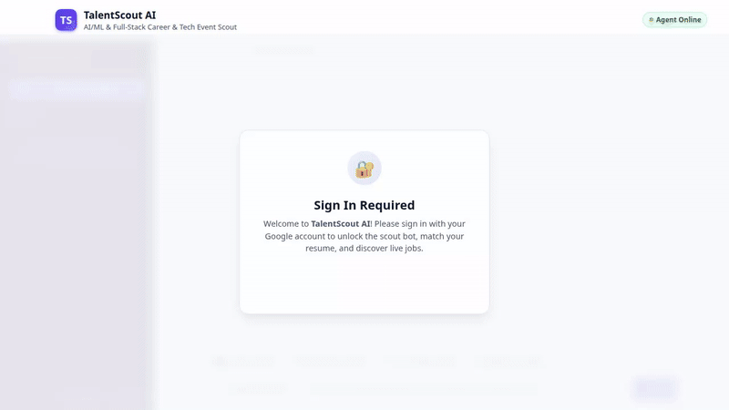

# TalentScout AI

> An autonomous career scout and tech event assistant specialized in AI/ML and Full-Stack engineering, built with Google's Agent Development Kit (ADK) and deployed on Google Cloud.



*Watch the high-definition video walkthrough: [demo.mp4](demo.mp4)*

---

## Live Deployment & Access

- **Live Application URL**: [https://talentscout-frontend-284031418526.us-east1.run.app](https://talentscout-frontend-284031418526.us-east1.run.app)
- **Deployment Platform**: Google Cloud Run (Containerized FastAPI Proxy + Antigravity Workspace Frontend)
- **Agent Reasoning Engine**: Google Vertex AI Agent Runtime (`projects/284031418526/locations/us-east1/reasoningEngines/8687670180593008640`)
- **Authentication**: Strict Google OAuth 2.0 Identity Services (`accounts.google.com/gsi/client`)

---

## Overview

**TalentScout AI** helps software engineers, researchers, and tech professionals navigate the rapidly evolving AI/ML landscape. It discovers live remote job opportunities, queries curated databases of tech conferences, evaluates resume-to-job match percentages, finds venues around conferences, remembers user preferences across sessions, and generates custom multimodal visual media (promotional banners and teaser videos).

The web interface is modeled after the **Google Antigravity IDE workspace**, featuring a collapsible sidebar with multi-session conversation history, thread switching, an integrated Candidate Profile customization modal, and intelligent geolocation for nearby developer events and jobs.

---

## Implemented Capabilities & Tools

Every capability listed below is implemented in this repository and wired to live tools in `app/` and endpoints in `frontend/`:

| Capability | Implementing Tool / Module | Description |
|---|---|---|
| **Google Sign-In & Auth Gate** | `frontend/main.py` (`/auth/google`), `frontend/static/index.html` | Secure one-click Google OAuth authentication via Google Identity Services (`google.auth.transport.requests`). Protects scout endpoints and personalizes user data. |
| **Antigravity-Style Workspace & Multi-Session Chat** | `frontend/static/index.html`, `frontend/main.py` (`/chat/sessions`, `/chat/history`) | Dark, persistent left conversation sidebar with `+ New Conversation`, isolated A2A context sessions, past conversation threads, and thread switching. |
| **Candidate Profile & Customization** | `frontend/static/index.html` (`#profile-modal`) | Interactive profile modal to customize Candidate Name, Target Role, Location (with 1-click auto-detect), Key Skills & Tech Stack, and attached resume. |
| **Multimodal Resume Upload & Parsing** | `frontend/main.py` (`/resume/upload`) | Upload PDF, TXT, or Markdown resumes parsed instantly by **Gemini 2.5 Flash Multimodal** to extract candidate role, skills, experience, and match summary. |
| **Location-Based Tech Events & Jobs** | `detectUserLocation()`, `findEventsNearMe()`, `app/firestore_service.py` | Automatically detects user location (IP & HTML5 Geolocation) and provides an interactive location override modal with tailored event searches. |
| **Live Remote Job Search** | `fetch_live_tech_jobs` (`app/external_api.py`) | Queries live engineering job postings across the web via the Remotive Jobs API with location, tag, and seniority filtering. |
| **Curated Job Catalog** | `search_jobs`, `add_job_posting` (`app/firestore_service.py`) | Searches and manages structured job listings in Google Cloud Firestore. |
| **Tech Conferences & Events** | `search_tech_events`, `add_tech_event` (`app/firestore_service.py`) | Discovers upcoming AI summits, hackathons, and developer conferences stored in Firestore. |
| **Resume & Skill Match Analysis** | `calculate_resume_match` (`app/firestore_service.py`) | Compares candidate skills against job requirements, calculating quantified match percentages, matching skills, and missing prerequisites. |
| **Secure Code Execution** | `AgentEngineSandboxCodeExecutor` (`app/agent.py`) | Safely executes Python code in an isolated Vertex AI Agent Engine Sandbox environment for compensation modeling, statistical analysis, and data transformation. |
| **Location & Venue Discovery** | `geocode_address`, `find_nearby_places` (`app/maps_service.py`) | Resolves venue locations with Google Maps Geocoding API and discovers nearby coffee shops, coworking spaces, and hotels with Google Maps Places API. |
| **Multimodal Image Generation** | `generate_opportunity_image` (`app/image_service.py`) | Uses `gemini-3.1-flash-lite-image` to generate promotional banners and event artwork, directly uploading bytes to Google Cloud Storage and returning a public HTTPS URL. |
| **Multimodal Video Generation** | `generate_opportunity_video` (`app/video_service.py`) | Uses Google's Omni model (`gemini-omni-flash-preview`) in the `global` region to produce promotional teaser videos, saving artifacts to the ADK session panel and uploading bytes to Google Cloud Storage. |
| **Cross-Session Long-Term Memory** | `PreloadMemoryTool`, `generate_memories_callback` (`app/agent.py`) | Persists candidate preferences, technical background, career goals, and dietary restrictions/allergies across conversations using Vertex AI Memory Bank. |
| **Rich A2UI Card Rendering** | `A2uiSchemaManager`, `a2ui_callback` (`app/a2ui_utils.py`) | Emits structured A2UI v0.8 Basic Catalog components (Cards, Columns, Rows, Text, Images) for clean visual presentation in chat interfaces. |

---

## Google Cloud Architecture & Services

- **Reasoning Model**: Google Gemini (`gemini-3.6-flash`) for multi-step reasoning, tool orchestration, and A2UI generation.
- **Multimodal Document Understanding**: Google Gemini (`gemini-2.5-flash`) for deep PDF resume analysis and skills extraction.
- **Agent Platform / Runtime**: Deployed via `agents-cli` to Vertex AI Agent Runtime with A2A (Agent-to-Agent) protocol support.
- **Vertex AI Memory Bank**: Managed memory service maintaining cross-session user context and personalized attributes.
- **Vertex AI Code Sandbox**: Isolated container sandbox environment for executing arbitrary Python computations.
- **Google Cloud Firestore**: Scalable NoSQL document database indexing jobs, events, and conversation thread history.
- **Google Cloud Storage**: Public bucket hosting generated banners, event graphics, and video teasers.
- **Google Maps Platform**: Geocoding and Places API integration for physical event and office location discovery.
- **Cloud Run**: Hosts the custom Antigravity chat web interface and FastAPI reverse proxy communicating with Agent Engine via A2A.

---

## Project Structure

```
talentscout-ai/
├── app/
│   ├── agent.py               # Root agent definition, system prompt, and tool registration
│   ├── a2ui_utils.py          # A2UI callback and schema integration for rich UI cards
│   ├── firestore_service.py   # Firestore queries for jobs, events, and resume matching
│   ├── external_api.py        # Live job search via Remotive API
│   ├── maps_service.py        # Google Maps Geocoding and Places integration
│   ├── image_service.py       # Gemini image generation and Cloud Storage upload
│   ├── video_service.py       # Gemini Omni video generation, artifact saving, and GCS upload
│   ├── fast_api_app.py        # ADK FastAPI backend wrapper
│   └── app_utils/             # Initialization and helper utilities
├── frontend/
│   ├── main.py                # FastAPI proxy with Google auth, session manager, and Gemini resume parser
│   ├── Dockerfile             # Container definition for Cloud Run deployment
│   ├── requirements.txt       # Frontend proxy dependencies
│   └── static/
│       └── index.html         # Antigravity chat workspace with sidebar, profile modal, and A2UI renderer
├── agents-cli-manifest.yaml   # Agent Platform deployment metadata
├── pyproject.toml             # Python dependencies and project settings
├── demo.gif                   # Looping walkthrough recording
├── demo.mp4                   # High-definition video recording of the application
└── README.md
```

---

## Setup and Local Development

### 1. Prerequisites

- Python 3.11+
- [Google Cloud SDK (`gcloud`)](https://cloud.google.com/sdk/docs/install)
- `agents-cli`:
  ```bash
  uv tool install google-agents-cli
  ```

### 2. Environment Configuration

Authenticate with Google Cloud and configure project settings:

```bash
gcloud auth login
gcloud auth application-default login
gcloud config set project <YOUR_GCP_PROJECT_ID>
```

Set the Google Maps API key if testing location services:

```bash
export GOOGLE_MAPS_API_KEY="<YOUR_MAPS_API_KEY>"
```

### 3. Install Dependencies

Install the project dependencies using `agents-cli` or `pip`:

```bash
agents-cli install
# or: pip install -e .
```

### 4. Run the Agent Locally

Launch the ADK development playground to interact with the agent:

```bash
agents-cli playground
```

### 5. Run the Custom Web Frontend Locally

To run the custom chat interface and FastAPI proxy locally:

```bash
cd frontend
pip install -r requirements.txt

export AGENT_ENGINE_RESOURCE_NAME="projects/<PROJECT_NUMBER>/locations/<REGION>/reasoningEngines/<ENGINE_ID>"
export AGENT_DIRECTORY="app"
export GOOGLE_CLIENT_ID="<YOUR_GOOGLE_CLIENT_ID>"
export PORT=8080

python main.py
```

Open `http://localhost:8080` in your browser to interact with the full Antigravity workspace interface.

---

## Deployment

### Deploy Agent to Agent Runtime

Deploy the agent logic, tools, and callbacks to Vertex AI Agent Platform:

```bash
agents-cli deploy --update-env-vars GOOGLE_MAPS_API_KEY="<YOUR_MAPS_API_KEY>"
```

### Deploy Frontend to Cloud Run

Build and deploy the chat frontend to Cloud Run:

```bash
cd frontend
gcloud run deploy talentscout-frontend \
  --source . \
  --region us-east1 \
  --allow-unauthenticated \
  --set-env-vars AGENT_ENGINE_RESOURCE_NAME="projects/284031418526/locations/us-east1/reasoningEngines/8687670180593008640",AGENT_DIRECTORY="app",GOOGLE_CLIENT_ID="284031418526-ph8a2s8ccokq3jjh9kduq71bl9k47kne.apps.googleusercontent.com"
```

Ensure the Cloud Run service account has `roles/aiplatform.user` permissions so it can query the deployed agent over A2A.
